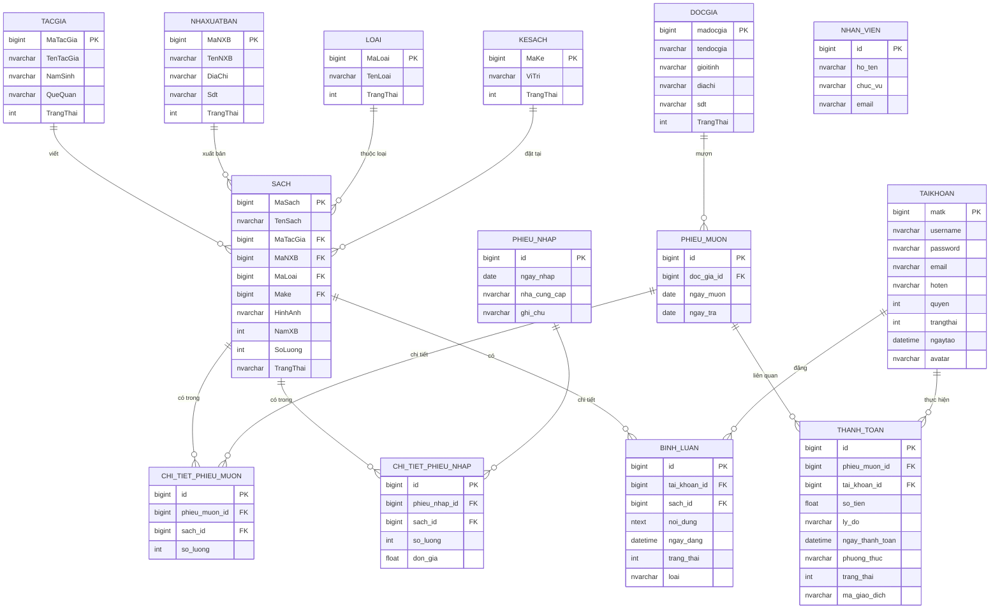

# 📚 HỆ THỐNG QUẢN LÝ THƯ VIỆN


## 📋 MỤC LỤC
1. [Giới thiệu](#-giới-thiệu)
2. [Tính năng](#-tính-năng)
3. [Công nghệ sử dụng](#-công-nghệ-sử-dụng)
4. [Cài đặt và Chạy](#-cài-đặt-và-chạy)
5. [Cấu trúc dự án](#-cấu-trúc-dự-án)
6. [Tài khoản mặc định](#-tài-khoản-mặc-định)
7. [API Endpoints](#-api-endpoints)
8. [Cơ sở dữ liệu](#-cơ-sở-dữ-liệu)
9. [Hướng dẫn sử dụng](#-hướng-dẫn-sử-dụng)
10. [Giấy phép](#-giấy-phép)

---

## 🎥 VIDEO DEMO (v1.2.0)

*Video minh họa: Truy cập Public -> Đăng nhập Độc giả -> Đặt trước sách với Số lượng -> Admin duyệt yêu cầu.*

---

## 📖 GIỚI THIỆU
Hệ thống Quản lý Thư viện là một ứng dụng web hiện đại được xây dựng bằng **Spring Boot 3** và **Thymeleaf**, cung cấp giải pháp quản lý toàn diện cho thư viện với giao diện Premium và trải nghiệm người dùng tối ưu.

---

## ✨ TÍNH NĂNG
### 🔐 Xác thực & Phân quyền (Updated)
- **Public Pages:** Cho phép khách truy cập không cần đăng nhập vào **Trang chủ (`/`)**, **Danh sách sách (`/sach`, `/products`)**, và **Trang giới thiệu (`/about`)**.
- **Unauthenticated Routes:** Route dành riêng cho người dùng chưa đăng nhập (Login/Register).
- **Smart Redirect:** Tự động đưa người dùng đã đăng nhập thoát khỏi trang login về trang chủ.
- **Phân quyền 4 cấp:** Admin, Thủ thư, Nhân viên, Khách hàng.

### 📚 Quản lý Sách
- CRUD sách với ảnh bìa (Hệ thống upload ảnh tối ưu).
- **Tính năng Đặt trước (Book Reservation):** 
  - Cho phép chọn ngày hẹn lấy sách.
  - **Mới:** Cho phép người dùng nhập **số lượng** quyển sách muốn đặt trước.
  - Tự động kiểm tra tồn kho và giới hạn số lượng đặt.

### 👥 Quản lý Độc giả
- Quản lý thông tin độc giả chi tiết, tự động tạo bản ghi cho khách hàng mới.
- Xem lịch sử mượn và đặt trước sách (Hiển thị chi tiết số lượng).

### 📖 Mượn - Trả Sách
- Quy trình mượn/trả chuyên nghiệp, tự động cập nhật số lượng sách trong kho.
- Chuyển đổi yêu cầu đặt trước thành phiếu mượn chỉ với 1 click từ Admin.

### 💬 Diễn đàn & Bình luận
- Hệ thống diễn đàn trao đổi chung và đánh giá (Rating) trực tiếp trên từng đầu sách.

### 📊 Thống kê & Dashboard
- Dashboard trực quan cho Admin với biểu đồ xu hướng và các chỉ số vận hành.

---

## 🛠 CÔNG NGHỆ SỬ DỤNG
| Công nghệ | Phiên bản | Mục đích |
| :--- | :--- | :--- |
| **Java** | 17 | Ngôn ngữ lập trình chính |
| **Spring Boot** | 3.2.2 | Framework ứng dụng |
| **Spring Security** | 6.x | Bảo mật, Phân quyền & Public Routes |
| **Spring Data JPA** | 3.x | Quản lý cơ sở dữ liệu (ORM) |
| **Thymeleaf** | 3.1 | Template Engine |
| **MySQL** | 8.0 | Cơ sở dữ liệu quan hệ |
| **Vanilla CSS** | - | Giao diện tùy chỉnh (Custom Premium UI) |

---

## 🚀 CÀI ĐẶT VÀ CHẠY
### Bước 1: Cấu hình Database
Tạo database tên `qltv`.

### Bước 2: Cài đặt Properties
Cập nhật `src/main/resources/application.properties` các thông số kết nối DB.

### Bước 3: Chạy ứng dụng
```bash
mvn spring-boot:run
```
Truy cập: `http://localhost:8080`

---

## 📁 CẤU TRÚC DỰ ÁN
```text
src/
├── main/
│   ├── java/com/example/library/
│   │   ├── config/      # SecurityConfig (Public/Private Routes)
│   │   ├── controller/  # AuthController, HomeController, SachController...
│   │   ├── entity/      # Sach, DocGia, DatTruoc...
│   │   ├── repository/  # Spring Data JPA Repositories
│   └── resources/
│       ├── static/      # CSS, JS, Image
│       ├── templates/   # Thymeleaf (index, sach, about, auth...)
```

---

## 🔑 TÀI KHOẢN MẶC ĐỊNH
| Username | Password | Quyền |
| :--- | :--- | :--- |
| **admin** | admin123 | Admin (Toàn quyền) |
| **thuthu** | thuthu123 | Thủ thư (Quản lý sách/mượn) |
| **nhanvien** | nhanvien123 | Nhân viên (Quản lý mượn/độc giả) |
| **Tanphong** | Tanphong | Khách hàng (Mượn/Đặt sách) |

---

## 🔌 API ENDPOINTS
*Đang cập nhật chi tiết các API...*

---

## 🗄️ CƠ SỞ DỮ LIỆU

### 📊 Sơ đồ quan hệ (ER Diagram)



### 📝 Chi tiết các bảng

| Bảng | Mô tả |
| :--- | :--- |
| **tacgia** | Lưu thông tin các tác giả sách. |
| **nhaxuatban** | Lưu thông tin các nhà xuất bản. |
| **loai** | Phân loại thể loại sách (Văn học, Khoa học...). |
| **kesach** | Quản lý vị trí kệ để sách trong thư viện. |
| **sach** | Thông tin chi tiết về các đầu sách và số lượng tồn. |
| **docgia** | Thông tin người mượn sách. |
| **phieu_muon** | Quản lý thông tin mượn sách của độc giả. |
| **chi_tiet_phieu_muon** | Chi tiết các quyển sách trong một phiếu mượn. |
| **phieu_nhap** | Quản lý việc nhập thêm sách vào kho. |
| **chi_tiet_phieu_nhap** | Chi tiết các quyển sách và đơn giá khi nhập kho. |
| **taikhoan** | Quản lý người dùng hệ thống (Admin, Nhân viên, Khách). |
| **binh_luan** | Lưu các bình luận, góp ý về sách. |
| **thanh_toan** | Quản lý các giao dịch thanh toán phí phạt. |
| **nhan_vien** | Thông tin nhân viên thư viện. |

### 💻 Script khởi tạo (SQL)

<details>
<summary>Nhấn để xem nội dung SQL chi tiết</summary>

```sql
-- Tạo cơ sở dữ liệu (nếu chưa có)
CREATE DATABASE qltv;
GO

USE qltv;
GO

-- Bảng tacgia
CREATE TABLE tacgia (
    MaTacGia bigint NOT NULL IDENTITY(1,1),
    TenTacGia nvarchar(255) NOT NULL,
    NamSinh nvarchar(10) NULL,
    QueQuan nvarchar(255) NULL,
    TrangThai int DEFAULT 1,
    PRIMARY KEY (MaTacGia)
);

-- Bảng nhaxuatban
CREATE TABLE nhaxuatban (
    MaNXB bigint NOT NULL IDENTITY(1,1),
    TenNXB nvarchar(255) NOT NULL,
    DiaChi nvarchar(255) NULL,
    Sdt nvarchar(20) NULL,
    TrangThai int DEFAULT 1,
    PRIMARY KEY (MaNXB)
);

-- Bảng loai
CREATE TABLE loai (
    MaLoai bigint NOT NULL IDENTITY(1,1),
    TenLoai nvarchar(255) NOT NULL,
    TrangThai int DEFAULT 1,
    PRIMARY KEY (MaLoai)
);

-- Bảng kesach
CREATE TABLE kesach (
    MaKe bigint NOT NULL IDENTITY(1,1),
    ViTri nvarchar(255) NULL,
    TrangThai int DEFAULT 1,
    PRIMARY KEY (MaKe)
);

-- Bảng sach
CREATE TABLE sach (
    MaSach bigint NOT NULL IDENTITY(1,1),
    TenSach nvarchar(255) NOT NULL,
    MaTacGia bigint NULL,
    MaNXB bigint NULL,
    MaLoai bigint NULL,
    Make bigint NULL,
    HinhAnh nvarchar(500) NULL,
    NamXB int NULL,
    SoLuong int DEFAULT 10,
    TrangThai nvarchar(10) DEFAULT '1',
    PRIMARY KEY (MaSach),
    FOREIGN KEY (MaTacGia) REFERENCES tacgia(MaTacGia),
    FOREIGN KEY (MaNXB) REFERENCES nhaxuatban(MaNXB),
    FOREIGN KEY (MaLoai) REFERENCES loai(MaLoai),
    FOREIGN KEY (Make) REFERENCES kesach(MaKe)
);

-- Bảng docgia
CREATE TABLE docgia (
    madocgia bigint NOT NULL IDENTITY(1,1),
    tendocgia nvarchar(255) NOT NULL,
    gioitinh nvarchar(10) NULL,
    diachi nvarchar(500) NULL,
    sdt nvarchar(20) NULL,
    TrangThai int DEFAULT 1,
    PRIMARY KEY (madocgia)
);

-- Bảng phieu_muon
CREATE TABLE phieu_muon (
    id bigint NOT NULL IDENTITY(1,1),
    doc_gia_id bigint NOT NULL,
    ngay_muon date NOT NULL,
    ngay_tra date NULL,
    PRIMARY KEY (id),
    FOREIGN KEY (doc_gia_id) REFERENCES docgia(madocgia)
);

-- Bảng chi_tiet_phieu_muon
CREATE TABLE chi_tiet_phieu_muon (
    id bigint NOT NULL IDENTITY(1,1),
    phieu_muon_id bigint NOT NULL,
    sach_id bigint NOT NULL,
    so_luong int NOT NULL,
    PRIMARY KEY (id),
    FOREIGN KEY (phieu_muon_id) REFERENCES phieu_muon(id),
    FOREIGN KEY (sach_id) REFERENCES sach(MaSach)
);

-- Bảng phieu_nhap
CREATE TABLE phieu_nhap (
    id bigint NOT NULL IDENTITY(1,1),
    ngay_nhap date NOT NULL,
    nha_cung_cap nvarchar(255) NULL,
    ghi_chu nvarchar(500) NULL,
    PRIMARY KEY (id)
);

-- Bảng chi_tiet_phieu_nhap
CREATE TABLE chi_tiet_phieu_nhap (
    id bigint NOT NULL IDENTITY(1,1),
    phieu_nhap_id bigint NOT NULL,
    sach_id bigint NOT NULL,
    so_luong int NOT NULL,
    don_gia float NOT NULL,
    PRIMARY KEY (id),
    FOREIGN KEY (phieu_nhap_id) REFERENCES phieu_nhap(id),
    FOREIGN KEY (sach_id) REFERENCES sach(MaSach)
);

-- Bảng taikhoan
CREATE TABLE taikhoan (
    matk bigint NOT NULL IDENTITY(1,1),
    username nvarchar(50) NOT NULL,
    password nvarchar(255) NOT NULL,
    email nvarchar(100) NULL,
    hoten nvarchar(100) NULL,
    quyen int DEFAULT 4,
    trangthai int DEFAULT 1,
    ngaytao datetime DEFAULT GETDATE(),
    reset_token nvarchar(100) NULL,
    avatar nvarchar(500) NULL,
    sodienthoai nvarchar(20) NULL,
    diachi nvarchar(500) NULL,
    PRIMARY KEY (matk),
    UNIQUE (username),
    UNIQUE (email)
);

-- Bảng binh_luan
CREATE TABLE binh_luan (
    id bigint NOT NULL IDENTITY(1,1),
    tai_khoan_id bigint NOT NULL,
    sach_id NULL,
    noi_dung ntext NOT NULL,
    ngay_dang datetime NULL,
    trang_thai int DEFAULT 1,
    loai nvarchar(20) DEFAULT 'GOP_Y',
    PRIMARY KEY (id),
    FOREIGN KEY (tai_khoan_id) REFERENCES taikhoan(matk),
    FOREIGN KEY (sach_id) REFERENCES sach(MaSach)
);

-- Bảng thanh_toan
CREATE TABLE thanh_toan (
    id bigint NOT NULL IDENTITY(1,1),
    phieu_muon_id bigint NOT NULL,
    tai_khoan_id bigint NOT NULL,
    so_tien float NOT NULL,
    ly_do nvarchar(255) DEFAULT 'Phí phạt trả sách quá hạn',
    ngay_thanh_toan datetime NULL,
    phuong_thuc nvarchar(50) DEFAULT 'TIEN_MAT',
    trang_thai int DEFAULT 1,
    ma_giao_dich nvarchar(50) NULL,
    ghi_chu nvarchar(500) NULL,
    PRIMARY KEY (id),
    UNIQUE (ma_giao_dich),
    FOREIGN KEY (phieu_muon_id) REFERENCES phieu_muon(id),
    FOREIGN KEY (tai_khoan_id) REFERENCES taikhoan(matk)
);

-- Bảng nhan_vien
CREATE TABLE nhan_vien (
    id bigint NOT NULL IDENTITY(1,1),
    ho_ten nvarchar(255) NOT NULL,
    chuc_vu nvarchar(100) NULL,
    email nvarchar(100) NULL,
    PRIMARY KEY (id)
);
```

</details>

---


## 📖 HƯỚNG DẪN SỬ DỤNG
1. **Dành cho Khách (Chưa Login)**: Có thể xem danh sách sách (`/sach`), xem thông tin thư viện (`/about`) và tìm kiếm sách.
2. **Dành cho Thành viên**: Đăng nhập để sử dụng tính năng **Đặt trước sách** (được chọn số lượng quyển muốn đặt).
3. **Dành cho Quản lý**: Đăng nhập tài khoản Admin/Thủ thư để duyệt các yêu cầu đặt trước và quản lý kho sách.
---

## 📄 GIẤY PHÉP
Phát hành dưới giấy phép **MIT**.

<p align="center"> 
  <b>Made with ❤️ by Antigravity AI & You</b><br> 
  <sub>© 2026 Library Management System. All rights reserved.</sub> 
</p>

