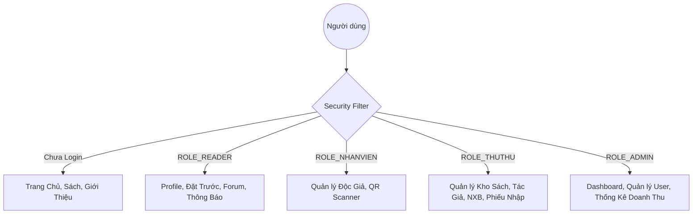
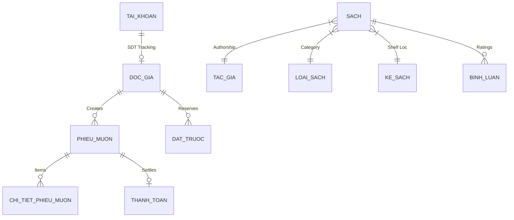

# 📚 LUYỆN KHÍ ĐƯỜNG - HỆ THỐNG QUẢN LÝ THƯ VIỆN PREMIUM

<p align="center">
  
  
  
  
</p>

---

## 📖 1. GIỚI THIỆU TỔNG QUAN

**Luyện Khí Đường** là hệ thống quản lý thư viện hiện đại được thiết kế với triết lý: "Kiến thức là nền tảng của sức mạnh". Hệ thống không chỉ quản lý sách và độc giả mà còn biến quá trình học hỏi thành một cuộc phiêu lưu **Tu Tiên (Cultivation)** độc đáo với các cấp bậc tu vi và đơn vị tiền tệ **Linh Thạch**.

### 🌟 Điểm nổi bật
- **Giao diện Premium**: Sử dụng Glassmorphism, hiệu ứng mờ nhòe (backdrop-filter), animations mượt mà và tối ưu hóa UX/UI cho mọi thiết bị.
- **Hệ thống Gamification**: Biến việc mượn sách thành việc "tích lũy tu vi", khuyến khích độc giả gắn bó lâu dài.
- **Công nghệ QR**: Tích hợp quét mã định danh độc giả và xử lý nghiệp vụ mượn sách siêu tốc thông qua Camera.
- **Bảo mật đa lớp**: Cơ chế phân quyền Role-Based Access Control (RBAC) chặt chẽ đến từng trang Controller.

---

## 🏷️ 2. HỆ THỐNG TU TIÊN & LINH THẠCH

### 🧬 Cấp Bậc Tu Vi (Ranking System)
Hệ thống tự động đồng bộ và xếp hạng Độc giả dựa trên tổng số sách đã mượn thành công. Cấp bậc này được hiển thị nổi bật trên Hồ sơ cá nhân (Profile) và Bảng xếp hạng:

| Cấp Bậc | Số Sách Yêu Cầu | Màu Sắc | Mã HSL |
| :--- | :--- | :--- | :--- |
| **Phàm Nhân** | 0 | Gray | `#7f8c8d` |
| **Luyện Khí** | 1 - 5 | Green | `#27ae60` |
| **Trúc Cơ** | 6 - 15 | Blue | `#2980b9` |
| **Kim Đan** | 16 - 30 | Yellow | `#f1c40f` |
| **Nguyên Anh** | 31 - 50 | Orange | `#e67e22` |
| **Hóa Thần** | > 50 | Purple | `#9b59b6` |

### 💎 Hệ Thống Linh Thạch (Loyalty Points)
Linh Thạch là đơn vị tiền tệ kỹ thuật số dùng để đo lường mức độ cống hiến và uy tín của độc giả.

> [!NOTE]
> Mọi giao dịch Linh Thạch đều được lưu trữ trực tiếp trong bảng `taikhoan` để đảm bảo tính nhất quán trên toàn hệ thống.

| Hành Động | Thưởng Linh Thạch | Mô tả |
| :--- | :--- | :--- |
| **Đăng ký (New Account)** | +100 | Quà tặng tân thủ khi gia nhập Luyện Khí Đường. |
| **Mượn Sách (New Voucher)** | +50 | Thưởng khi phát sinh giao dịch mượn sách mới. |
| **Trả Sách Đúng Hạn** | +100 | Khuyến khích độc giả trả sách văn minh, đúng thời hạn. |
| **Bình luận & Rating** | +10 | Thưởng khi đạo hữu chia sẻ cảm nghĩ về một bộ sách. |
| **Thanh toán Phí Phạt** | +100 | Vinh danh độc giả hoàn thành nghĩa vụ tài chính khi quá hạn. |

---

## 🛠️ 3. TỔ CHỨC KỸ THUẬT & KIẾN TRÚC

### 🧱 Tech Stack Chi Tiết
- **Backend**: Spring Boot 3.2.2 (Java 17).
- **Security**: Spring Security 6 (Custom RBAC, NoOp Password Encoding cho môi trường học tập).
- **Data persistence**: Spring Data JPA + Hibernate 6 + MySQL 8.0.
- **UI Engine**: Thymeleaf Layout Dialect + Security Extras.
- **Frontend Assets**: CSS3 (Vanilla), JS (Vanilla + JavaScript Modules).
- **Integrations**: Google ZXing (Zebra Crossing) cho xử lý mã QR.

### 🏛️ Sơ đồ Phân Quyền (Security Filter Chain)

```mermaid
graph TD
    User((Người dùng)) --> Filter{Security Filter}
    Filter -->|Chưa Login| Public[Trang Chủ, Sách, Giới Thiệu]
    Filter -->|ROLE_READER| Reader[Profile, Đặt Trước, Forum, Thông Báo]
    Filter -->|ROLE_NHANVIEN| Staff[Quản lý Độc Giả, QR Scanner]
    Filter -->|ROLE_THUTHU| Librarian[Quản lý Kho Sách, Tác Giả, NXB, Phiếu Nhập]
    Filter -->|ROLE_ADMIN| Admin[Dashboard, Quản lý User, Thống Kê Doanh Thu]
```

---

## 📊 4. MÔ HÌNH DỮ LIỆU (DATABASE SCHEMA)

Cơ sở dữ liệu được thiết kế tối ưu với 16 bảng quan hệ, hỗ trợ đầy đủ các nghiệp vụ từ quản lý kho đến tài chính.


```mermaid
erDiagram
    TAI_KHOAN ||--o| DOC_GIA : "SDT Tracking"
    DOC_GIA ||--o{ PHIEU_MUON : "Creates"
    DOC_GIA ||--o{ DAT_TRUOC : "Reserves"
    PHIEU_MUON ||--o{ CHI_TIET_PHIEU_MUON : "Items"
    PHIEU_MUON ||--o| THANH_TOAN : "Settles"
    SACH }|--|| TAC_GIA : "Authorship"
    SACH }|--|| LOAI_SACH : "Category"
    SACH }|--|| KE_SACH : "Shelf Loc"
    SACH ||--o{ BINH_LUAN : "Ratings"
```

### 📒 Các bảng dữ liệu trọng yếu:
- **`taikhoan`**: `id`, `username`, `password`, `quyen` (1:Admin, 2:Staff/Librarian, 3:Reader), `linh_thach`, `avatar`.
- **`docgia`**: `madocgia`, `tendocgia`, `sdt`, `diachi`, `ngaytao`.
- **`sach`**: `masach`, `tensach`, `so_luong`, `gia_muon`, `average_rating`, `rating_count`.
- **`phieumuon`**: `id`, `ngay_muon`, `ngay_tra_du_kien`, `tien_phat`.
- **`thanhtoan`**: `ma_giao_dich`, `so_tien`, `phuong_thuc` (TIEN_MAT/CHUYEN_KHOAN), `ngay_thanh_toan`.

---

## 🔗 5. HƯỚNG DẪN NGHIỆP VỤ & API

### 🛡️ Module Quản Trị Hệ Thống (`/admin`)
- **Dashboard**: `GET /admin/dashboard` - Xem biểu đồ tăng trưởng độc giả và doanh thu Linh Thạch/VNĐ.
- **Chiến lược Sách**: `GET /admin/sach` - Quản lý metadata sách, tác giả và kệ sách.

### 📚 Module Nghiệp Vụ Thư Viện (`/phieumuon`)
- **Xử lý Mượn**: `GET /phieumuon/add` - Cung cấp giao diện quét QR để tự động điền mã độc giả.
- **Thanh Toán**: `GET /phieumuon/thanh-toan/{id}` - Tính toán tự động số ngày mượn, số ngày quá hạn và tổng phí (VND).

### 👤 Module Người Dùng Cá Nhân (`/profile`)
- **Identity**: `GET /profile/qr-code` - Hệ thống sinh mã QR động với nội dung `READER:ID` để đọc bằng scanner tại quầy.
- **Tùy biến Profile**: Hỗ trợ upload ảnh đại diện (MultipartFile) với cơ chế lưu trữ redundancy (cấp nguồn src và target classes).

---

## 🌊 6. CÀI ĐẶT & VẬN HÀNH (DEVOPS)

### 🚀 Quy trình thực thi
1. **Khởi tạo Database**: Chạy SQL Script (Update DDL tự động bật trong `application.properties`).
2. **Cấu hình Môi trường**:
   - `spring.datasource.url=jdbc:mysql://localhost:3306/qltv`
   - `app.upload.dir=uploads/img/sach/`
3. **Build n Run**:
   ```bash
   mvn clean install
   mvn spring-boot:run
   ```

### 📡 Keep-Alive Engine
Để đảm bảo hệ thống không bị "ngủ đông" khi deploy trên Cloud (Render, Fly.io), hệ thống sử dụng một tác vụ nền tự động ping chính mình:
- **Ping URL**: `http://localhost:8080/ping`
- **Tần suất**: Tự động hóa thông qua config `app.keep-alive.enabled=true`.

---

## 📜 7. NHẬT KÝ PHIÊN BẢN (CHANGELOG)

### 💠 v1.9.0 - UI Mastery Update
- [x] Tối ưu hóa Z-index cho hệ thống Header và Modals (2000 vs 3000).
- [x] Sửa lỗi xung đột màu icon active trong Sidebar.
- [x] Đồng bộ hệ thống Linh Thạch trên Global Header thông qua `ControllerAdvice`.

### 💠 v1.8.0 - Smart Scanning
- [x] Tích hợp thư viện `html5-qrcode` xử lý camera trực tiếp.
- [x] Liên kết ID Tài khoản và ID Độc giả trong luồng nghiệp vụ quét mã.

### 💠 v1.5.0 - Gamification Engine
- [x] Triển khai Rank logic (6 cấp bậc tu tiên).
- [x] Hệ thống cộng/trừ Linh Thạch tự động theo Trigger nghiệp vụ.

---

<p align="center"> 
  <b>Premium Documentation by Antigravity AI & You</b><br> 
  <sub>© 2026 Luyện Khí Đường - Giải pháp Thư viện 4.0.</sub> 
</p>

