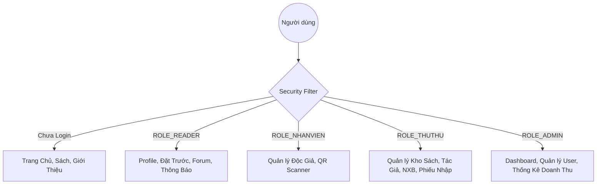
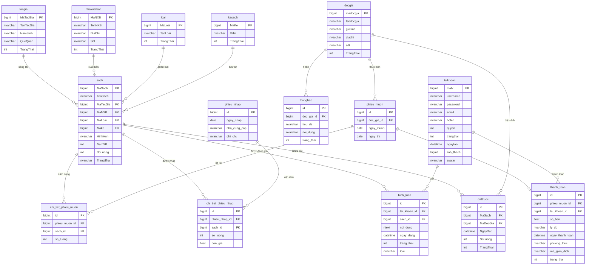

# 📚 LUYỆN KHÍ ĐƯỜNG - HỆ THỐNG QUẢN LÝ THƯ VIỆN PREMIUM

<p align="center">
  
  
  
  
</p>

---

## 📖 1. GIỚI THIỆU TỔNG QUAN

**Luyện Khí Đường** là hệ thống quản lý thư viện hiện đại được thiết kế với triết lý: "Kiến thức là nền tảng của sức mạnh". Hệ thống không chỉ quản lý sách và độc giả mà còn biến quá trình học hỏi thành một cuộc phiêu lưu **Tu Tiên (Cultivation)** độc đáo với các cấp bậc tu vi và đơn vị tiền tệ **Linh Thạch**.

### 🌟 Điểm nổi bật
- **Giao diện Premium**: Sử dụng Glassmorphism, hiệu ứng mờ nhòe (backdrop-filter), animations mượt mà và tối ưu hóa UX/UI cho mọi thiết bị.
- **Hệ thống Gamification**: Biến việc mượn sách thành việc "tích lũy tu vi", khuyến khích độc giả gắn bó lâu dài.
- **Công nghệ QR**: Tích hợp quét mã định danh độc giả và xử lý nghiệp vụ mượn sách siêu tốc thông qua Camera.
- **Bảo mật đa lớp**: Cơ chế phân quyền Role-Based Access Control (RBAC) chặt chẽ đến từng trang Controller.

---

## 🏷️ 2. HỆ THỐNG TU TIÊN & LINH THẠCH

### 🧬 Cấp Bậc Tu Vi (Ranking System)
Hệ thống tự động đồng bộ và xếp hạng Độc giả dựa trên tổng số sách đã mượn thành công. Cấp bậc này được hiển thị nổi bật trên Hồ sơ cá nhân (Profile) và Bảng xếp hạng:

| Cấp Bậc | Số Sách Yêu Cầu | Màu Sắc | Mã HSL |
| :--- | :--- | :--- | :--- |
| **Phàm Nhân** | 0 | Gray | `#7f8c8d` |
| **Luyện Khí** | 1 - 5 | Green | `#27ae60` |
| **Trúc Cơ** | 6 - 15 | Blue | `#2980b9` |
| **Kim Đan** | 16 - 30 | Yellow | `#f1c40f` |
| **Nguyên Anh** | 31 - 50 | Orange | `#e67e22` |
| **Hóa Thần** | > 50 | Purple | `#9b59b6` |

### 💎 Hệ Thống Linh Thạch (Loyalty Points)
Linh Thạch là đơn vị tiền tệ kỹ thuật số dùng để đo lường mức độ cống hiến và uy tín của độc giả.

> [!NOTE]
> Mọi giao dịch Linh Thạch đều được lưu trữ trực tiếp trong bảng `taikhoan` để đảm bảo tính nhất quán trên toàn hệ thống.

| Hành Động | Thưởng Linh Thạch | Mô tả |
| :--- | :--- | :--- |
| **Đăng ký (New Account)** | +100 | Quà tặng tân thủ khi gia nhập Luyện Khí Đường. |
| **Mượn Sách (New Voucher)** | +50 | Thưởng khi phát sinh giao dịch mượn sách mới. |
| **Trả Sách Đúng Hạn** | +100 | Khuyến khích độc giả trả sách văn minh, đúng thời hạn. |
| **Bình luận & Rating** | +10 | Thưởng khi đạo hữu chia sẻ cảm nghĩ về một bộ sách. |
| **Thanh toán Phí Phạt** | +100 | Vinh danh độc giả hoàn thành nghĩa vụ tài chính khi quá hạn. |

---

## 🛠️ 3. CÔNG NGHỆ VÀ CÔNG CỤ PHÁT TRIỂN

Hệ thống được xây dựng trên nền tảng công nghệ mạnh mẽ, đảm bảo tính ổn định, bảo mật và khả năng mở rộng cao.

### 🌐 Tech Stack Core
- **Backend Framework**: [Spring Boot 3.2.2](https://spring.io/projects/spring-boot) (Java 17).
- **Security**: Spring Security 6 (Cấu hình RBAC, Filter Chain bảo mật đa lớp).
- **Data Persistence**: Spring Data JPA + Hibernate 6.
- **Database**: [MySQL 8.0](https://www.mysql.com/) (Hệ quản trị CSDL quan hệ mạnh mẽ).
- **Template Engine**: [Thymeleaf](https://www.thymeleaf.org/) (Server-side Java template engine).

### 🎨 Frontend & UI/UX
- **Styling**: Vanilla CSS3 (Custom Glassmorphism, Backdrop Filters).
- **Logic**: Vanilla JavaScript (ES6+), Module-based components.
- **Iconography**: FontAwesome 6 / Boxicons.
- **Animations**: CSS Keyframes + AOS (Animate On Scroll).

### ⚙️ Công cụ & Thư viện (Tools & Libraries)
- **Build Tool**: [Apache Maven](https://maven.apache.org/) (Quản lý dependency và lifecycle).
- **Utilities**: [Project Lombok](https://projectlombok.org/) (Giảm thiểu boilerplate code).
- **Integrations**: [Google ZXing](https://github.com/zxing/zxing) (Xử lý và sinh mã QR).
- **QR Scanner**: `html5-qrcode` (Thư viện xử lý camera trực tiếp trên trình duyệt).

### 🖥️ Môi trường phát triển (Development Environment)
- **IDE**: Visual Studio Code / IntelliJ IDEA.
- **Database Tool**: MySQL Workbench / DBeaver.
- **Version Control**: Git (Quản lý mã nguồn trên GitHub).
- **API Testing**: Postman (Kiểm thử các endpoint nghiệp vụ).

### 🏛️ Sơ đồ Phân Quyền (Security Filter Chain)

```mermaid
graph TD
    User((Người dùng)) --> Filter{Security Filter}
    Filter -->|Chưa Login| Public[Trang Chủ, Sách, Giới Thiệu]
    Filter -->|ROLE_READER| Reader[Profile, Đặt Trước, Forum, Thông Báo]
    Filter -->|ROLE_NHANVIEN| Staff[Quản lý Độc Giả, QR Scanner]
    Filter -->|ROLE_THUTHU| Librarian[Quản lý Kho Sách, Tác Giả, NXB, Phiếu Nhập]
    Filter -->|ROLE_ADMIN| Admin[Dashboard, Quản lý User, Thống Kê Doanh Thu]
```

---

## 📊 4. MÔ HÌNH DỮ LIỆU (DATABASE SCHEMA)

Cơ sở dữ liệu được thiết kế đồng bộ với 16 bảng quan hệ, hỗ trợ đầy đủ các nghiệp vụ từ quản lý kho đến vinh danh tu vi.

### 📐 Sơ đồ Quan hệ Thực thể chi tiết (Detailed ER Diagram)

```mermaid
erDiagram
    tacgia ||--o{ sach : "sáng tác"
    nhaxuatban ||--o{ sach : "xuất bản"
    loai ||--o{ sach : "phân loại"
    kesach ||--o{ sach : "lưu trữ"
    sach ||--o{ chi_tiet_phieu_muon : "nằm trong"
    sach ||--o{ chi_tiet_phieu_nhap : "được nhập"
    sach ||--o{ binh_luan : "được đánh giá"
    sach ||--o{ dattruoc : "được đặt"
    docgia ||--o{ phieu_muon : "thực hiện"
    docgia ||--o{ dattruoc : "đặt sách"
    docgia ||--o{ thongbao : "nhận"
    phieu_muon ||--o{ chi_tiet_phieu_muon : "liệt kê"
    phieu_muon ||--o| thanh_toan : "đối trừ"
    phieu_nhap ||--o{ chi_tiet_phieu_nhap : "vận đơn"
    taikhoan ||--o{ binh_luan : "viết"
    taikhoan ||--o{ thanh_toan : "thanh toán"

    tacgia {
        bigint MaTacGia PK
        nvarchar TenTacGia
        nvarchar NamSinh
        nvarchar QueQuan
        int TrangThai
    }
    nhaxuatban {
        bigint MaNXB PK
        nvarchar TenNXB
        nvarchar DiaChi
        nvarchar Sdt
        int TrangThai
    }
    loai {
        bigint MaLoai PK
        nvarchar TenLoai
        int TrangThai
    }
    kesach {
        bigint MaKe PK
        nvarchar ViTri
        int TrangThai
    }
    sach {
        bigint MaSach PK
        nvarchar TenSach
        bigint MaTacGia FK
        bigint MaNXB FK
        bigint MaLoai FK
        bigint Make FK
        nvarchar HinhAnh
        int NamXB
        int SoLuong
        nvarchar TrangThai
    }
    docgia {
        bigint madocgia PK
        nvarchar tendocgia
        nvarchar gioitinh
        nvarchar diachi
        nvarchar sdt
        int TrangThai
    }
    phieu_muon {
        bigint id PK
        bigint doc_gia_id FK
        date ngay_muon
        date ngay_tra
    }
    chi_tiet_phieu_muon {
        bigint id PK
        bigint phieu_muon_id FK
        bigint sach_id FK
        int so_luong
    }
    phieu_nhap {
        bigint id PK
        date ngay_nhap
        nvarchar nha_cung_cap
        nvarchar ghi_chu
    }
    chi_tiet_phieu_nhap {
        bigint id PK
        bigint phieu_nhap_id FK
        bigint sach_id FK
        int so_luong
        float don_gia
    }
    taikhoan {
        bigint matk PK
        nvarchar username
        nvarchar password
        nvarchar email
        nvarchar hoten
        int quyen
        int trangthai
        datetime ngaytao
        bigint linh_thach
        nvarchar avatar
    }
    binh_luan {
        bigint id PK
        bigint tai_khoan_id FK
        bigint sach_id FK
        ntext noi_dung
        datetime ngay_dang
        int trang_thai
        nvarchar loai
    }
    thanh_toan {
        bigint id PK
        bigint phieu_muon_id FK
        bigint tai_khoan_id FK
        float so_tien
        nvarchar ly_do
        datetime ngay_thanh_toan
        nvarchar phuong_thuc
        nvarchar ma_giao_dich
        int trang_thai
    }
    dattruoc {
        bigint id PK
        bigint MaSach FK
        bigint MaDocGia FK
        datetime NgayDat
        int SoLuong
        int TrangThai
    }
    thongbao {
        bigint id PK
        bigint doc_gia_id FK
        nvarchar tieu_de
        nvarchar noi_dung
        int trang_thai
    }
```

### 📒 Chi tiết các bảng dữ liệu
1.  **`tacgia`**: Thông tin tác giả (Tên, Năm sinh, Quê quán).
2.  **`nhaxuatban`**: Thông tin nhà xuất bản (Tên, Địa chỉ, SĐT).
3.  **`loai`**: Danh mục thể loại sách (Văn học, Khoa học, v.v.).
4.  **`kesach`**: Vị trí lưu trữ vật lý trong thư viện.
5.  **`sach`**: Bảng trung tâm chứa thông tin sách, số lượng và trạng thái.
6.  **`docgia`**: Thông tin độc giả, đặc biệt tích hợp **Tu Tiên Rank**.
7.  **`phieu_muon`**: Quản lý thông tin mượn và ngày trả.
8.  **`chi_tiet_phieu_muon`**: Chi tiết các đầu sách trong một lần mượn.
9.  **`phieu_nhap`**: Quản lý nhập kho từ nhà cung cấp.
10. **`chi_tiet_phieu_nhap`**: Chi tiết số lượng và đơn giá nhập.
11. **`taikhoan`**: Quản lý đăng nhập, vai trò, **Linh Thạch** và Avatar.
12. **`binh_luan`**: Hệ thống feedback, đánh giá sao cho sách.
13. **`thanh_toan`**: Biên lai tài chính, phí phạt quá hạn.
14. **`nhan_vien`**: Danh sách nhân sự vận hành thư viện.

### 💾 Kịch bản Khởi tạo (SQL Script)
<details>
<summary><b>Click để xem SQL Script khởi tạo Database (MS SQL Server)</b></summary>

```sql
-- Tạo cơ sở dữ liệu
CREATE DATABASE qltv;
GO
USE qltv;
GO

-- Cấu trúc các bảng chính
CREATE TABLE tacgia ( MaTacGia bigint NOT NULL IDENTITY(1,1) PRIMARY KEY, TenTacGia nvarchar(255) NOT NULL, NamSinh nvarchar(10) NULL, QueQuan nvarchar(255) NULL, TrangThai int DEFAULT 1 );
CREATE TABLE nhaxuatban ( MaNXB bigint NOT NULL IDENTITY(1,1) PRIMARY KEY, TenNXB nvarchar(255) NOT NULL, DiaChi nvarchar(255) NULL, Sdt nvarchar(20) NULL, TrangThai int DEFAULT 1 );
CREATE TABLE loai ( MaLoai bigint NOT NULL IDENTITY(1,1) PRIMARY KEY, TenLoai nvarchar(255) NOT NULL, TrangThai int DEFAULT 1 );
CREATE TABLE kesach ( MaKe bigint NOT NULL IDENTITY(1,1) PRIMARY KEY, ViTri nvarchar(255) NULL, TrangThai int DEFAULT 1 );
CREATE TABLE sach ( MaSach bigint NOT NULL IDENTITY(1,1) PRIMARY KEY, TenSach nvarchar(255) NOT NULL, MaTacGia bigint, MaNXB bigint, MaLoai bigint, Make bigint, HinhAnh nvarchar(500), NamXB int, SoLuong int DEFAULT 10, TrangThai nvarchar(10) DEFAULT '1' );
CREATE TABLE docgia ( madocgia bigint NOT NULL IDENTITY(1,1) PRIMARY KEY, tendocgia nvarchar(255) NOT NULL, gioitinh nvarchar(10), diachi nvarchar(500), sdt nvarchar(20), TrangThai int DEFAULT 1 );
CREATE TABLE taikhoan ( matk bigint NOT NULL IDENTITY(1,1) PRIMARY KEY, username nvarchar(50) UNIQUE NOT NULL, password nvarchar(255) NOT NULL, email nvarchar(100) UNIQUE, hoten nvarchar(100), quyen int DEFAULT 4, trangthai int DEFAULT 1, linh_thach bigint DEFAULT 100 );

-- Liên kết (Foreign Keys)
ALTER TABLE sach ADD CONSTRAINT FK_Sach_TacGia FOREIGN KEY (MaTacGia) REFERENCES tacgia(MaTacGia);
ALTER TABLE sach ADD CONSTRAINT FK_Sach_NXB FOREIGN KEY (MaNXB) REFERENCES nhaxuatban(MaNXB);
ALTER TABLE phieu_muon ADD CONSTRAINT FK_PM_DocGia FOREIGN KEY (doc_gia_id) REFERENCES docgia(madocgia);
-- ... (Xem file SQL đầy đủ trong source code)
```
> [!IMPORTANT]
> Script đầy đủ bao gồm dữ liệu mẫu (Seed Data) cho 5 Tác giả, 5 NXB và các tài khoản mặc định (admin/thuthu/nhanvien).
</details>

---

## 🔗 5. HƯỚNG DẪN NGHIỆP VỤ & API

### 🛡️ Module Quản Trị Hệ Thống (`/admin`)
- **Dashboard**: `GET /admin/dashboard` - Xem biểu đồ tăng trưởng độc giả và doanh thu Linh Thạch/VNĐ.
- **Chiến lược Sách**: `GET /admin/sach` - Quản lý metadata sách, tác giả và kệ sách.

### 📚 Module Nghiệp Vụ Thư Viện (`/phieumuon`)
- **Xử lý Mượn**: `GET /phieumuon/add` - Cung cấp giao diện quét QR để tự động điền mã độc giả.
- **Thanh Toán**: `GET /phieumuon/thanh-toan/{id}` - Tính toán tự động số ngày mượn, số ngày quá hạn và tổng phí (VND).

### 👤 Module Người Dùng Cá Nhân (`/profile`)
- **Identity**: `GET /profile/qr-code` - Hệ thống sinh mã QR động với nội dung `READER:ID` để đọc bằng scanner tại quầy.
- **Tùy biến Profile**: Hỗ trợ upload ảnh đại diện (MultipartFile) với cơ chế lưu trữ redundancy (cấp nguồn src và target classes).

---

## 🌊 6. CÀI ĐẶT & VẬN HÀNH (DEVOPS)

### 🚀 Quy trình thực thi
1. **Khởi tạo Database**: Chạy SQL Script (Update DDL tự động bật trong `application.properties`).
2. **Cấu hình Môi trường**:
   - `spring.datasource.url=jdbc:mysql://localhost:3306/qltv`
   - `app.upload.dir=uploads/img/sach/`
3. **Build n Run**:
   ```bash
   mvn clean install
   mvn spring-boot:run
   ```

### 📡 Keep-Alive Engine
Để đảm bảo hệ thống không bị "ngủ đông" khi deploy trên Cloud (Render, Fly.io), hệ thống sử dụng một tác vụ nền tự động ping chính mình:
- **Ping URL**: `http://localhost:8080/ping`
- **Tần suất**: Tự động hóa thông qua config `app.keep-alive.enabled=true`.

---

## 📜 7. NHẬT KÝ PHIÊN BẢN (CHANGELOG)

### 💠 v1.9.0 - UI Mastery Update
- [x] Tối ưu hóa Z-index cho hệ thống Header và Modals (2000 vs 3000).
- [x] Sửa lỗi xung đột màu icon active trong Sidebar.
- [x] Đồng bộ hệ thống Linh Thạch trên Global Header thông qua `ControllerAdvice`.

### 💠 v1.8.0 - Smart Scanning
- [x] Tích hợp thư viện `html5-qrcode` xử lý camera trực tiếp.
- [x] Liên kết ID Tài khoản và ID Độc giả trong luồng nghiệp vụ quét mã.

### 💠 v1.5.0 - Gamification Engine
- [x] Triển khai Rank logic (6 cấp bậc tu tiên).
- [x] Hệ thống cộng/trừ Linh Thạch tự động theo Trigger nghiệp vụ.

---

<p align="center"> 
  <b>Premium Documentation by Antigravity AI & You</b><br> 
  <sub>© 2026 Luyện Khí Đường - Giải pháp Thư viện 4.0.</sub> 
</p>

